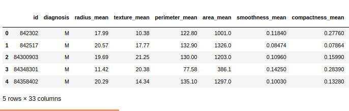
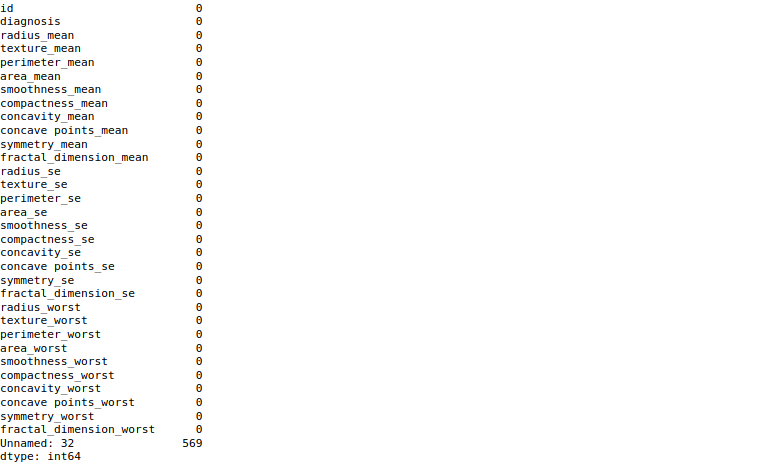
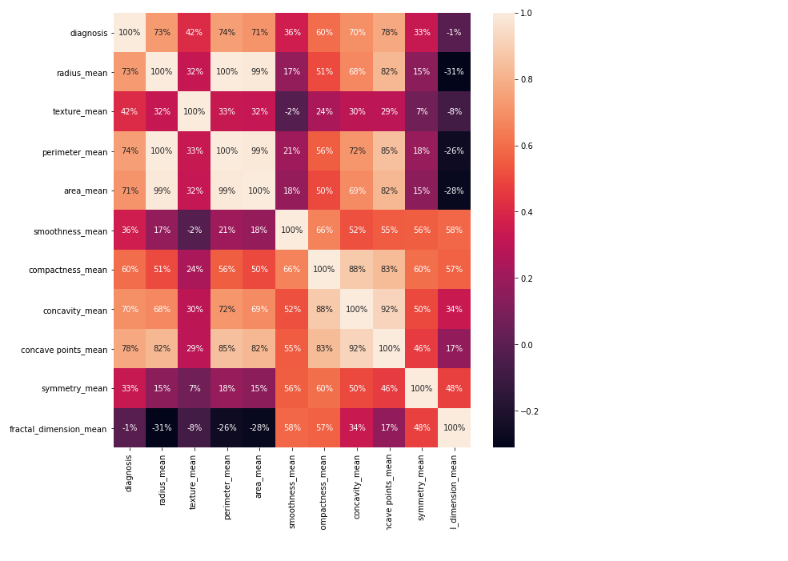
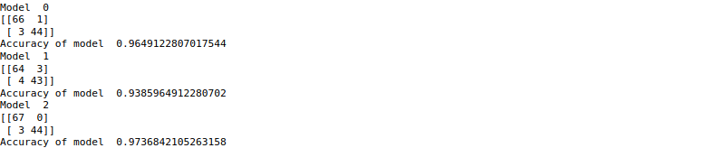

<div align="center">

# Breast Cancer Prediction Using Machine Learning


</div>
<br>
<br>

# Introduction
Breast cancer (BC) is one of the most common cancers among women worldwide, representing the majority of new cancer cases and cancer-related deaths according to global statistics, making it a significant public health problem in today’s society.
The early diagnosis of BC can improve the prognosis and chance of survival significantly, as it can promote timely clinical treatment to patients. Further accurate classification of benign tumors can prevent patients undergoing unnecessary treatments. Thus, the correct diagnosis of BC and classification of patients into malignant or benign groups is the subject of much research. Because of its unique advantages in critical features detection from complex BC datasets, machine learning (ML) is widely recognized as the methodology of choice in BC pattern classification and forecast modelling.
Classification and data mining methods are an effective way to classify data. Especially in medical field, where those methods are widely used in diagnosis and analysis to make decisions.

## Recommended Screening Guidelines:

Mammography. The most important screening test for breast cancer is the mammogram. A mammogram is an X-ray of the breast. It can detect breast cancer up to two years before the tumor can be felt by you or your doctor.
Women age 40–45 or older who are at average risk of breast cancer should have a mammogram once a year.
Women at high risk should have yearly mammograms along with an MRI starting at age 30.
Some Risk Factors for Breast Cancer
The following are some of the known risk factors for breast cancer. However, most cases of breast cancer cannot be linked to a specific cause. Talk to your doctor about your specific risk.
Age. The chance of getting breast cancer increases as women age. Nearly 80 percent of breast cancers are found in women over the age of 50.
Personal history of breast cancer. A woman who has had breast cancer in one breast is at an increased risk of developing cancer in her other breast.
Family history of breast cancer. A woman has a higher risk of breast cancer if her mother, sister or daughter had breast cancer, especially at a young age (before 40). Having other relatives with breast cancer may also raise the risk.
Genetic factors. Women with certain genetic mutations, including changes to the BRCA1 and BRCA2 genes, are at higher risk of developing breast cancer during their lifetime. Other gene changes may raise breast cancer risk as well.
Childbearing and menstrual history. The older a woman is when she has her first child, the greater her risk of breast cancer. Also at higher risk are:
Women who menstruate for the first time at an early age (before 12)
Women who go through menopause late (after age 55)
Women who’ve never had children

# Research Methodology

## Phase 0 — Data Preparation

We will use the Kaggle UCI data set for breast cancer prediction.

[https://www.kaggle.com/uciml/breast-cancer-wisconsin-data](https://www.kaggle.com/uciml/breast-cancer-wisconsin-data)

In this datasets, There are 32 features which help out to predict cancer. Features are computed from a digitized image of a fine needle aspirate (FNA) of a breast mass. They describe characteristics of the cell nuclei present in the image. 
Attribute Information:
1) ID number
2) Diagnosis (M = malignant, B = benign)
3-32)
real-valued features are computed for each cell nucleus:

> * Radius_mean : Mean of distances from center to points on the perimeter
> * Texture_mean : standard deviation of gray-scale values
> * Perimeter_mean : mean size of the core tumor
> * Smoothness_mean : mean of local variation in radius lengths
> * Compactness_mean : mean of perimeter^2 / area - 1.0
> * Concavity_mean : mean of severity of concave portions of the contour
> * Concave points_mean : mean for number of concave portions of the contour
> * Fractal_dimension_mean : mean for "coastline approximation" - 1
> * Radius_se : standard error for standard deviation of gray-scale values
> * Smoothness_se : standard error for local variation in radius lengths
> * Compactness_se : standard error for perimeter^2 / area - 1.0
> * Concavity_se : standard error for severity of concave portions of the contour
> * Fractal_dimension_worst : "worst" or largest mean value for "coastline approximation" - 1

These are the few features that increase/decrease the chances of cancer. You can check all the features of the dataset on the link given above.

# Objectives

This analysis aims to observe which features are most helpful in predicting malignant or benign cancer and to see general trends that may aid us in model selection and hyper parameter selection. The goal is to classify whether the breast cancer is benign or malignant. To achieve this i have used machine learning classification methods to fit a function that can predict the discrete class of new input.

## Phase 1 — Data Exploration

We will be using Jupyter-Notebook to work on this dataset. We will first go with importing the necessary libraries and import our dataset to Jupyter-Notebook :

```Python
#importing libraries
import numpy as np
import pandas as pd
import matplotlib.pyplot as plt
import seaborn as sns

#Load the data
df = pd.read_csv('data.csv')
df.head()
```



We can find the dimensions of the data set using the panda dataset ‘shape’ attribute.

```Python
#Number and rows and columns in the datasets
df.shape
```


## Missing or Null Data points

We can find any missing or null data points of the data set (if there is any) using the following pandas function.

```python
#Count the number of empty values in each column
df.isna().sum()
```


There is a column that has all the null values so we have to drop it.

```python
#Drop the empty column
df=df.dropna(axis=1)
```

# Phase 2 — Categorical Data

Categorical data are variables that contain label values rather than numeric values.The number of possible values is often limited to a fixed set.

For example, users are typically described by country, gender, age group etc.

We will use Label Encoder to label the categorical data. Label Encoder is the part of SciKit Learn library in Python and used to convert categorical data, or text data, into numbers, which our predictive models can better understand.

```python
from sklearn.preprocessing import LabelEncoder
labelencoder_Y = LabelEncoder()
df.iloc[:,1] = labelencoder_Y.fit_transform(df.iloc[:,1].values)
```
## Splitting the dataset

The data we use is usually split into training data and test data. The training set contains a known output and the model learns on this data in order to be generalized to other data later on. We have the test dataset (or subset) in order to test our model’s prediction on this subset.

We will do this using SciKit-Learn library in Python using the train_test_split method.

```python
#split the data set into independent (x) and dependent (y) data sets
X=df.iloc[:,2:31].values
Y=df.iloc[:,1].values
#split the data set
from sklearn.model_selection import train_test_split
X_train, X_test, Y_train, Y_test = train_test_split(X,Y,test_size =0.20, random_state=0)
```

## Finding Correalation

```python
#Get the correlation of the columns
df.iloc[:,1:32].corr()
#visualize the correlation
plt.figure(figsize=(10,10))
sns.heatmap(df.iloc[:,1:12].corr(),annot=True,fmt='.0%')
```


# Phase 3 — Feature Scaling

Most of the times, your dataset will contain features highly varying in magnitudes, units and range. But since, most of the machine learning algorithms use Eucledian distance between two data points in their computations. We need to bring all features to the same level of magnitudes. This can be achieved by scaling. This means that you’re transforming your data so that it fits within a specific scale, like 0–100 or 0–1.

We will use StandardScaler method from SciKit-Learn library.

```python
#Feature Scaling
from sklearn.preprocessing import StandardScaler
sc = StandardScaler()
X_train = sc.fit_transform(X_train)
X_test = sc.fit_transform(X_test)
```

# Phase 4 — Model Selection

This is the most exciting phase in Applying Machine Learning to any Dataset. It is also known as Algorithm selection for Predicting the best results.

Usually Data Scientists use different kinds of Machine Learning algorithms to the large data sets. But, at high level all those different algorithms can be classified in two groups : supervised learning and unsupervised learning.

Without wasting much time, I would just give a brief overview about these two types of learnings.

Supervised learning : Supervised learning is a type of system in which both input and desired output data are provided. Input and output data are labelled for classification to provide a learning basis for future data processing. Supervised learning problems can be further grouped into Regression and Classification problems.

A regression problem is when the output variable is a real or continuous value, such as “salary” or “weight”.

A classification problem is when the output variable is a category like filtering emails “spam” or “not spam”

Unsupervised Learning : Unsupervised learning is the algorithm using information that is neither classified nor labeled and allowing the algorithm to act on that information without guidance.

In our dataset we have the outcome variable or Dependent variable i.e Y having only two set of values, either M (Malign) or B(Benign). So we will use Classification algorithm of supervised learning.

We have different types of classification algorithms in Machine Learning :-

>  Logistic Regression
> 
>  Decision Tree
> 
>  Random Forest Classifier

Lets start applying the algorithms :

We will use sklearn library to import all the methods of classification algorithms.

```python
# Function for Models
def models(X_train , Y_train):
    #Logistic Regression
    from sklearn.linear_model import LogisticRegression
    log = LogisticRegression(random_state=0)
    log.fit(X_train, Y_train)
    
    #Decision Tree
    from sklearn.tree import DecisionTreeClassifier
    tree = DecisionTreeClassifier(criterion='entropy', random_state=0)
    tree.fit(X_train, Y_train)
    
    #Random Forest Classifier
    from sklearn.ensemble import RandomForestClassifier
    forest = RandomForestClassifier(n_estimators=10, criterion='entropy',random_state=0)
    forest.fit(X_train,Y_train)
    
    print('[0]Logistic Regression trainning accuracy:',log.score(X_train,Y_train))
    print('[1]Decision trainning accuracy:',tree.score(X_train,Y_train))
    print('[2]Random Forest classifier trainning accuracy:',forest.score(X_train,Y_train))
    
    return log,tree,forest

model = models(X_train,Y_train)
```


To check the accuracy we need to import confusion_matrix method of metrics class. The confusion matrix is a way of tabulating the number of mis-classifications, i.e., the number of predicted classes which ended up in a wrong classification bin based on the true classes.

To check the correct prediction we have to check confusion matrix object and add the predicted results diagonally which will be number of correct prediction and then divide by total number of predictions.

```python
#testing the model on the test data (confusion matrix)
from sklearn.metrics import confusion_matrix
for i in range(len(model)):
    print('Model ', i)
    cm = confusion_matrix(Y_test,model[i].predict(X_test))
    print(cm)
    TP = cm[0][0]
    TN = cm[1][1]
    FP = cm[0][1]
    FN = cm[1][0]
    Accuracy = (TP + TN)/(TP+TN+FN+FP)
    print('Accuracy of model ', Accuracy)
```



**So finally we have built our classification model and we can see that Random Forest Classification algorithm gives the best results for our dataset. Well its not always applicable to every dataset. To choose our model we always need to analyze our dataset and then apply our machine learning model.**


# Future Scope 

Every year, Pathologists diagnose 14 million new patients with cancer around the world. That’s millions of people who’ll face years of uncertainty.

Pathologists have been performing cancer diagnoses and prognoses for decades. Most pathologists have a 96–98% success rate for diagnosing cancer. They’re pretty good at that part.

The problem comes in the next part. According to the Oslo University Hospital, the accuracy of prognoses is only 60% for pathologists. A prognosis is the part of a biopsy that comes after cancer has been diagnosed, it is predicting the development of the disease.

It’s time for the next step to be taken in pathology.
Introducing Machine Learning

—

## The next step in pathology is Machine Learning.

—

Machine Learning (ML) is one of the core branches of Artificial Intelligence. It’s a system which takes in data, finds patterns, trains itself using the data and outputs an outcome.

So what makes a machine better than a trained professional?

ML has key advantages over Pathologists.

Firstly, machines can work much faster than humans. A biopsy usually takes a Pathologist 10 days. A computer can do thousands of biopsies in a matter of seconds.

Machines can do something which humans aren’t that good at. They can repeat themselves thousands of times without getting exhausted. After every iteration, the machine repeats the process to do it better. Humans do it too, we call it practice. While practice may make perfect, no amount of practice can put a human even close to the computational speed of a computer.

Another advantage is the great accuracy of machines. With the advent of the Internet of Things technology, there is so much data out in the world that humans can’t possibly go through it all. That’s where machines help us. They can do work faster than us and make accurate computations and find patterns in data. That’s why they’re called computers.
